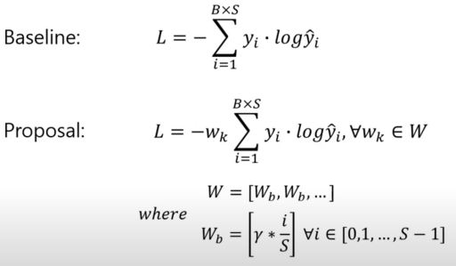
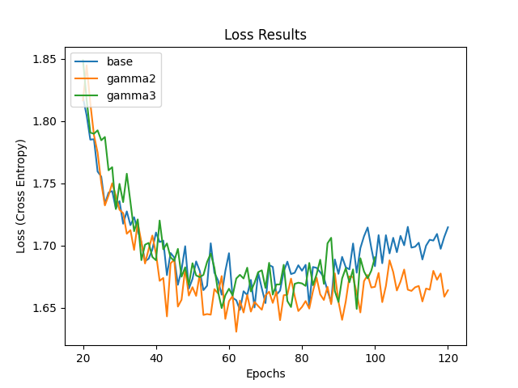
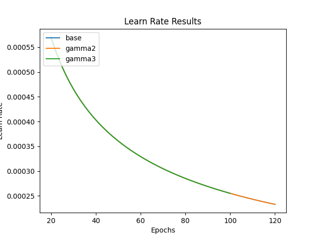

# Music Transformer
[](https://colab.research.google.com/github/asigalov61/SuperPiano/blob/master/Super_Piano_3.ipynb)

Currently supports Pytorch >= 1.2.0 with Python >= 3.6  

There is now a much friendlier [Google Colab version](https://github.com/asigalov61/SuperPiano/blob/master/Super_Piano_3.ipynb) of this project courtesy of [Alex](https://github.com/asigalov61)! 

## About
This is a reproduction of the MusicTransformer (Huang et al., 2018) for Pytorch. This implementation utilizes the generic Transformer implementation introduced in Pytorch 1.2.0 (https://pytorch.org/docs/stable/nn.html#torch.nn.Transformer).

## Generated Music:
Some various music results (midi and mp3) are in the following Google Drive folder:  
https://drive.google.com/drive/folders/1qS4z_7WV4LLgXZeVZU9IIjatK7dllKrc?usp=sharing

See the results section for the model hyperparameters used for generation.

Mp3 results were played through a [Kawai MP11SE](https://kawaius.com/product/mp11se/). 
In order to play .mid files, we used [Midi Editor](https://www.midieditor.org/) which is free to use and open source.

## TODO
* Write own midi pre-processor (sustain pedal errors with jason's)
   * Support any midi file beyond Maestro
* Fixed length song generation
* Midi augmentations from paper
* Multi-GPU support

## How to run
1. Download the Maestro dataset (we used v2 but v1 should work as well). You can download the dataset [here](https://magenta.tensorflow.org/datasets/maestro). You only need the MIDI version if you're tight on space. 

2. Run `git submodule update --init --recursive` to get the MIDI pre-processor provided by jason9693 et al. (https://github.com/jason9693/midi-neural-processor), which is used to convert the MIDI file into discrete ordered message types for training and evaluating. 

3. Run `preprocess_midi.py -output_dir <path_to_save_output> <path_to_maestro_data>`, or run with `--help` for details. This will write pre-processed data into folder split into `train`, `val`, and `test` as per Maestro's recommendation.

4. To train a model, run `train.py`. Use `--help` to see the tweakable parameters. See the results section for details on model performance. 

5. After training models, you can evaluate them with `evaluate.py` and generate a MIDI piece with `generate.py`. To graph and compare results visually, use `graph_results.py`.

For the most part, you can just leave most arguments at their default values. If you are using a different dataset location or other such things, you will need to specify that in the arguments. Beyond that, the average user does not have to worry about most of the arguments.

### Training
As an example to train a model using the parameters specified in results:

```
python train.py -output_dir rpr --rpr 
```
You can additonally specify both a weight and print modulus that determine what epochs to save weights and what batches to print. The weights that achieved the best loss and the best accuracy (separate) are always stored in results, regardless of weight modulus input.

**Modified loss function**



### Evaluation
You can evaluate a model using;
```
python evaluate.py -model_weights rpr/results/best_acc_weights.pickle --rpr
```

Your model's results may vary because a random sequence start position is chosen for each evaluation piece. This may be changed in the future.

### Generation
You can generate a piece with a trained model by using:
```
python generate.py -output_dir output -model_weights rpr/results/best_acc_weights.pickle --rpr
```

The default generation method is a sampled probability distribution with the softmaxed output as the weights. You can also use beam search but this simply does not work well and is not recommended.

## Pytorch Transformer
We used the Transformer class provided since Pytorch 1.2.0 (https://pytorch.org/docs/stable/nn.html#torch.nn.Transformer). The provided Transformer assumes an encoder-decoder architecture. To make it decoder-only like the Music Transformer, you use stacked encoders with a custom dummy decoder. This decoder-only model can be found in model/music_transformer.py.

At the time this reproduction was produced, there was no Relative Position Representation (RPR) (Shaw et al., 2018) support in the Pytorch Transformer code. To account for the lack of RPR support, we modified Pytorch 1.2.0 Transformer code to support it. This is based on the Skew method proposed by Huang et al. which is more memory efficient. You can find the modified code in model/rpr.py. This modified Pytorch code will not be kept up to date and will be removed when Pytorch provides RPR support.

## Results
We trained a base and RPR model with the following parameters (taken from the paper) for 120 epochs:
* **learn_rate**: None
* **ce_smoothing**: None
* **batch_size**: 8
* **max_sequence**: 2048
* **n_layers**: 6
* **num_heads**: 8
* **d_model**: 512
* **dim_feedforward**: 1024
* **dropout**: 0.1

The following graphs were generated with the command: 
```
python graph_results.py -input_dirs base_model/results?rpr_model/results -model_names base?rpr
```

Note, multiple input models are separated with a '?'






## Discussion
The results were overall close to the results from the paper. Huang et al. reported a loss of around 1.8 for the base and rpr models on Maestro V1. We use Maestro V2 and perform no midi augmentations as they had discussed in their paper. Furthermore, [there are issues with how sustain is handled](https://github.com/jason9693/midi-neural-processor/pull/2) which can be observed by listening to some pre-processed midi files. More refinement with the addition of those augmentations and fixes may yield the loss results in line with the paper.


